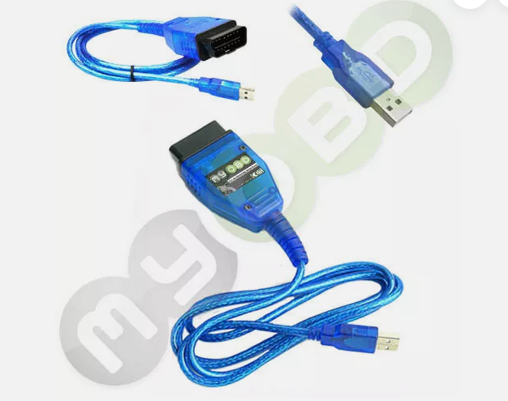

# OBD KW 1281 protocol

There are excellent sources for reading on how to handle the protocol:
* https://www.blafusel.de/obd/obd2_kw1281.html

I am using the FTDI version. As there a slight differences in baudrate like 9600baud vs 10400baud, the FTDI is a good choice to program the exact needed baudrate.

## the idea

```
CAR <===> OBD (KW1281) <===> USB <===> RPI CM4 (server) <===> Websocket <===> Website
```
* RPI CM4 (server) ... see [/c++](/c++)


## OBD Adapter (KKL USB OBD Diagnose Interface) for VAG VW Audi Seat Skoda (older models)

I am using this adapter for my passat 1999 3b2 (B5):

```
    Neue Version von 2025 des USB KKL Diagnose Interfaces
    Für VAG VW Audi Seat Skoda Modelle bis ca. Bj 2004
    Mit echtem FTDI Chip!

    Viele Anbieter hier auf eBay kopieren unsere Beschreibung nur
    aber bei uns bekommen Sie auch das was angeboten wird - Versprochen!

    Neue Schutzschaltung + Anleitung + Treiber, daher nun auch die
    verbesserte Verbindung mit den alten sowie auch neueren Fahrzeugen.
    
Für Audi-Modelle:
-Kompatibel: A2/A3/A4 Cabriolet/A6/A8/S2/S3/TT
-Nicht kompatibel:80/100/200/A3(8P)/A4(B7)/A4(B5)/A6(C6/4F)/A8/A8L(D3/4E)/Q7
 
Für SEAT-Modelle:
-Kompatibel: Alhambra / Altea / Arosa / Cordoba / Ibiza / Inca / Leon MK 1 / Leon MK 2 / Toledo
-Nicht kompatibel: Altea (5P) / Leon (1P) / Toledo (5P)
 
Für Skoda-Modelle:
-Kompatibel: Fabia/Felicia/Octavia MK 1/Octavia MK 2/Superb
-Nicht kompatibel: Octavia (1Z)
 
Für VW-Modelle:
-Kompatibel:Beetle/Bora/Caddy/Corrado/Golf MK2/Golf MK3/Golf MK4/Jetta MK3/Jetta MK4/
 Lupo/Passat MK3/Passat MK4/Polo MK3/Polo MK4/Touran/Touareg/Transporter T3/Transporter T4/ Transporter T5.

-Nicht kompatibel: Caddy (2K) / Golf MK5 (1K) / Golf Plus / Jetta MK5 (1K) / 
Passat MK5 (B6) / Passat MK6 (B6) / Phaeton/Touran (1T)
```



seller on ebay: [link](https://www.ebay.de/sch/i.html?_ssn=kds-tec&store_name=kdstec&_oac=1&_trksid=p4429486.m3561.l161211)


## python

The python script works out of the box for 5baud init and also reading manufacturer information, group values, ...

Actually I used it for testing and fiddling around. For performance reason C++ was the much better suited solution. Thus I transferred the knowledge from python to C++.

## C++

This is a C++ websocket server that connects to the OBD interface of the car and receives requests via websocket, while the received data from the car is sent back via websocket.

I see this as backend for my website, that displays the status of my passat.

requirements
* libftdi-dev 
* libusb-1.0-0-dev

building in linux

```
cd c++
mkdir build
cd build

cmake ..

cmake --build . -- -j 3

```

